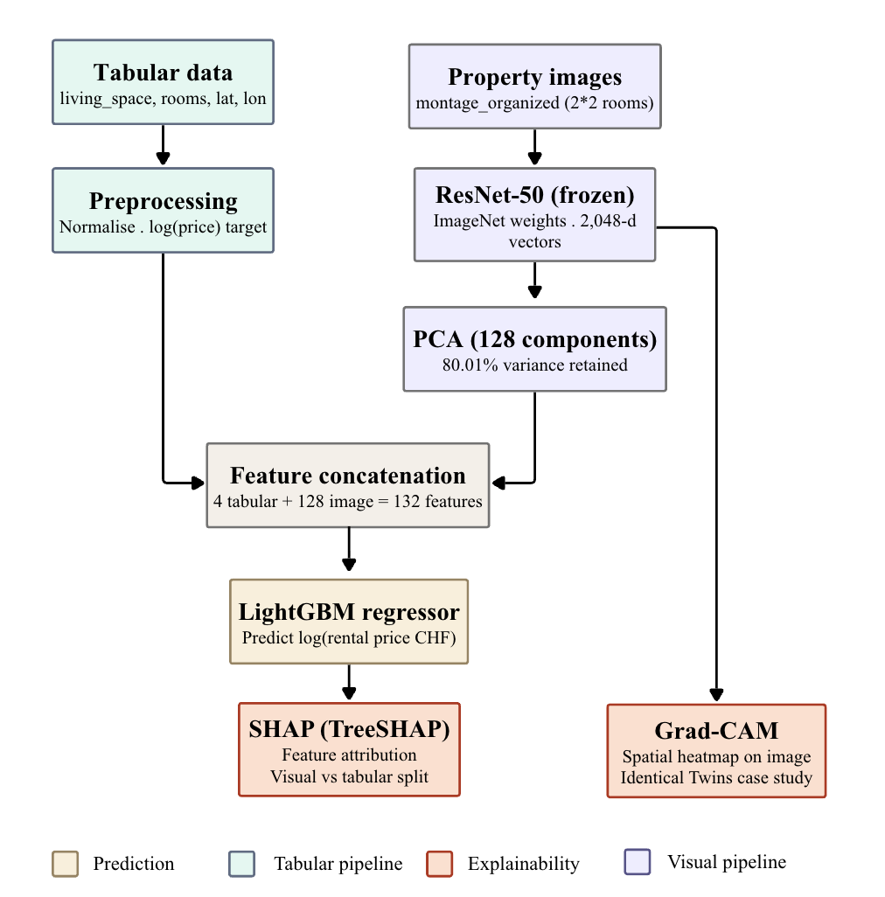

# Multimodal XAI Framework for Real Estate Valuation

Bachelor's Capstone Project — IE University, Data & Business Analytics  
Jessie Calix | Supervisor: Antonio Zabaleta Moreno | April 2026

---

Most Automated Valuation Models (AVMs) rely only on structured data and offer no explanation for their predictions. This project addresses both problems: it combines **property images** with tabular features to capture what structured data misses, and uses **SHAP + Grad-CAM** to make every prediction interpretable.

Tested on the Swiss Real Estate Dataset — 11,105 rental listings with matched tabular data and property images.

## Architecture



## Results

| Model | RMSE (CHF) | R² | MAPE (%) |
|---|---|---|---|
| LightGBM — tabular only | 267 | 0.774 | 10.43 |
| LightGBM — image only | 514 | 0.160 | 20.46 |
| **LightGBM — multimodal** | **290** | **0.732** | **10.22** |
| XGBoost — multimodal | 294 | 0.725 | 10.58 |

Visual features account for a mean of **54.2%** of individual prediction explanations across the test set. The Identical Twins case study shows that structurally near-identical properties in the same area receive different predictions driven primarily by visual SHAP contributions.

## Notebooks

| # | Notebook | Description |
|---|---|---|
| 01 | `01_eda.ipynb` | Exploratory data analysis |
| 02 | `02_visual_feature_extraction.ipynb` | ResNet-50 embeddings + PCA |
| 03 | `03_model_training.ipynb` | Model training + evaluation |
| 04 | `04_shap_explainability.ipynb` | SHAP global/local attribution |
| 05 | `05_identical_twins.ipynb` | Identical Twins case study + Grad-CAM |

Run in order. Notebooks 03–05 depend on embeddings saved in 02. GPU recommended for 02.

## Setup

```bash
pip install -r requirements.txt
```

> The dataset is not included. Download it from the [original repository](https://github.com/IliaAzizi/Swiss-Real-Estate-Dataset).

## Citation

```
Calix, J. (2026). A Multimodal XAI Framework for Real Estate Valuation.
Bachelor's Capstone Project, IE University.
```
